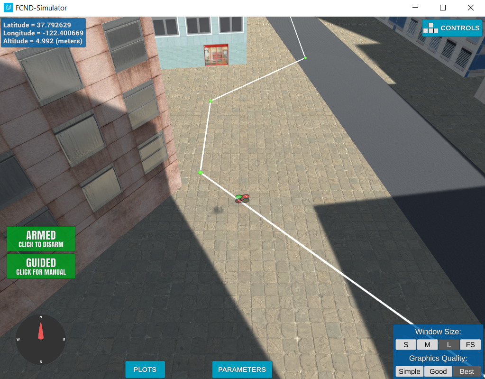
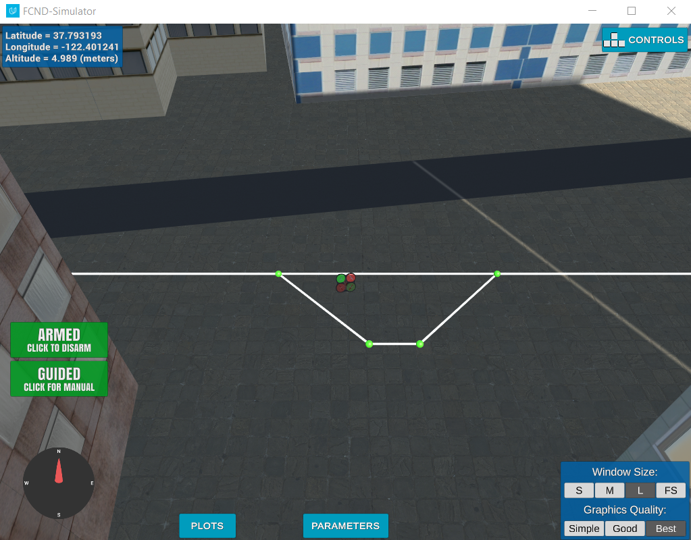

## Project: 3D Motion Planning


---

## [Rubric](https://review.udacity.com/#!/rubrics/1534/view) Points 

---
### Implementation Notes

This solution was developed using JetBrains PyCharm in Windows 10 rather than the Udacity-provided VM. Much of the work was done with minimal internet access.


### Explain the Starter Code

#### 1. Explain the functionality of what's provided in `motion_planning.py` and `planning_utils.py`

`motion_planning.py`

The starter code creates a state machine that does the following:
1. Creates a connection to the Udacity simulator
2. Creates a drone object that is connected to the simulator
3. Initializes the basic callbacks that are needed to monitor the drone's status and initiate state changes
4. Creates a template that takes the drone through the following states
* Manual (entry point))
* Arming (Taking control and starting the motors)
* Planning (planning a path - adding waypoints to a buffer)
* Takeoff (Going up to the target cruising altitude)
* Waypoint (Following the waypoints)
* Landing (Descending)
* Disarming (Shutting down)

`planning_utils.py`

Contains python utility code to:
* Create a 2D obstacle grid given a cruising altitude, a clearance distance, and a colliders csv file
* A basic A* implementation to plan a path through the 2D obstacle grid (waypoints are not pruned yet)

### Implementing Your Path Planning Algorithm

#### 1. Set your global home position
Read the first line of the csv file, extract lat0 and lon0 as floating point values and use the self.set_home_position() method to set global home.
* This was done using standard python file I/O to read the first line and then split() and strip() to get the coordinates
* The home position was then set with these coordinates at an altitude of 0 (the Unity model did not have varying ground level)

#### 2. Set your current local position
The local position was calculated using the udacidrone.frame_utils library that was already imported in the starter code.

#### 3. Set grid start position from local position
The grid start position was set from the local position. Note that the grid position is in integer "grid" units so that they may be used as indices into a numpy array.

#### 4. Set grid goal position from geodetic coords
The goal position is set from latitude and longitude that is passed into the program through runtime arguments in a call like this:

```python.exe motion_planning.py --lat 37.793155 --long -122.402035```

#### 5. Modify A* to include diagonal motion (or replace A* altogether)
A* was modified to add the 4 diagonals in addition to the cardinal directions.
* These were added to the action enum with costs of sqrt(2)
* valid_actions was modified to check the diagonals and remove them if necessary, just like it already checked the cardinal directions 

#### 6. Cull waypoints 
Extra waypoints were culled using a simple colinearity test.

Colinearity is checked by calculating the area of the triangle created by points A, B, and C. If the area is zero, the points are colinear. Close to zero is close enough; it doesn't have to be exactly zero.

If point B is on the line between points A and C, remove it and repeat.


### Performance Notes

#### The path could still use some optimization.

Sometimes the shortest path is not directly towards the goal. This can be seen below where the heuristic guides A* into a corner that it later has to back out of.

One solution would be to run another iteration on the waypoints after colinearity pruning to see if any can be removed while not causing a collision. The case below is an example where this would help.




Given more time, more advanced planning solutions could be developed.

#### Overshooting Waypoints

Some of the waypoints ended up pretty close to obstacles. It wouldn't take much overshoot to get a collision. I had planned to add some code to the state machine to slow down the drone as it neared intermediate waypoints; especially ones with extreme direction changes. I didn't see anywhere in the API that I could change the speed at which the drone flies towards the command position. It seems to be hard coded.  

#### The Path is Not the Same in Both Directions

I believe this was pointed out in the lessons, but it's still worth pointing out. At least with the current A* implementation, a path back to the starting point will not necessarily be identical to the path going outward. The image below shows one such difference.



